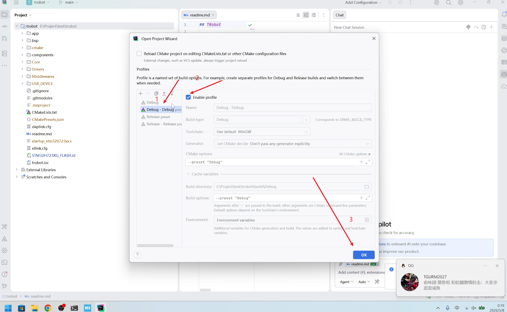
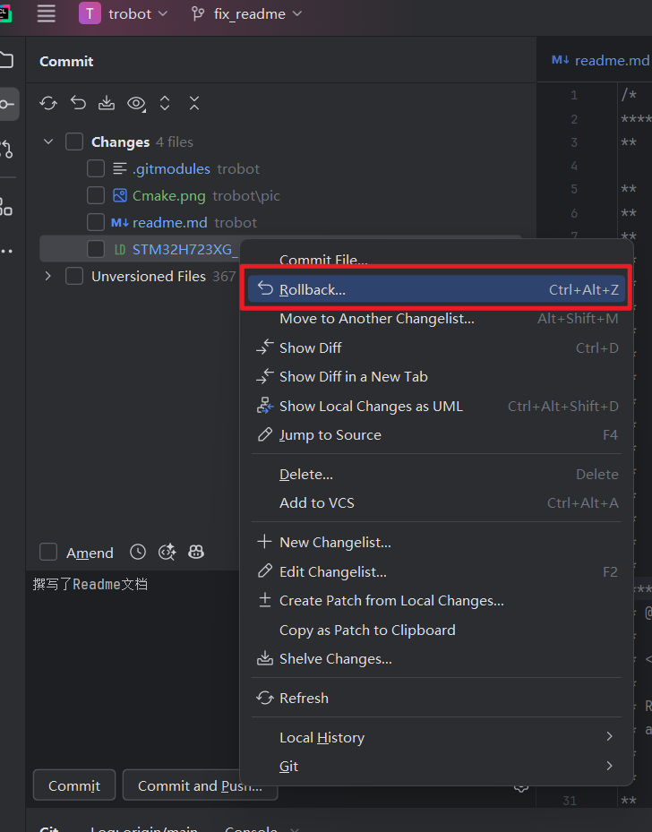
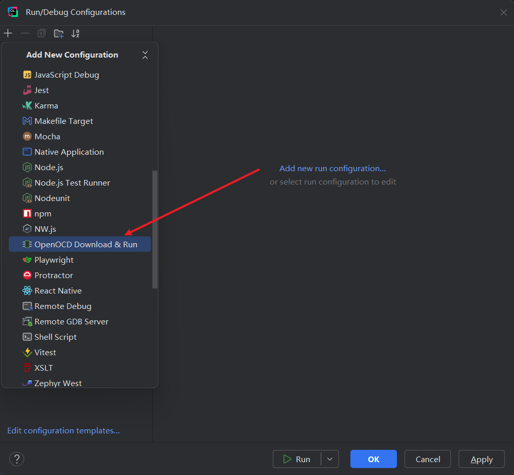

## TRobot

**T**GU **R**obot: The next robot embedded development framework.

### 快速开始

**setp1. 克隆项目代码**
```shell
git clone https://github.com/lym12321/trobot.git --recursive
```

**需要特别注意的是，此处在执行 git clone 命令时，应当添加 *--recursive* 参数。**

此处可根据实际需求选择安装对应组件。

#### RoboMaster 裁判系统通信组件

项目地址：  
<https://github.com/lym12321/tr_comp_robomaster>

添加子模块命令：

```shell
git submodule add -f https://github.com/lym12321/tr_comp_robomaster.git components/robomaster
```

**step2. 使用CubeMX生成代码**
使用CubeMX打开```.ioc```文件，点击```GENERATE CODE```按钮生成代码。

**step3. 在CLion中打开项目文件夹并配置CMake预设**

在CLion中打开本项目，在CMake配置中选择preset预配置CMake文件。 
1. 取消勾选默认的CMake文件的Enable profile 
2. 选择第二个带有Debug preset标识的预设 
3. 勾选新的CMake文件的Enable profile


**step4. 回滚```.ld```文件（仅限trobot主仓库，f4版本跳过即可）**

由于CubeMX生成的```.ld```文件会覆盖原有文件，因此需要将其回滚到之前的版本。


**step5. 编译烧录**

配置OpenOCD烧录工具，编译并烧录代码。
1. 在CLion的右上角点开你的项目配置界面添加OpenOCD的配置

   

   

2. 在OpenOCD配置界面选择trobot和你使用的烧录器```.cfg```文件

   


> [!CAUTION]
> - 该项目仍在开发中，尚未完成，部分功能可能无法使用。
> - 此版本相对于前期项目有较大改动，请确保在完全理解项目代码逻辑后使用，**不要**直接复制旧代码的参数和逻辑。